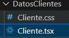

# DATOS DEL CLIENTE. 
## Componente de datos del cliente creado.



## Vista de regsitro para los datos del cliente.


## Código del componente "Datos del cliente".

```tsx
return (
    <IonCard>
      <IonCardHeader>
        <IonCardTitle>Datos del Cliente
        </IonCardTitle>
      </IonCardHeader>
      <IonCardContent>
        <IonItem>
          <IonLabel position="floating">Nombre
          </IonLabel>
          <IonInput
            value={nombre}
            onIonChange={e => setNombre(e.detail.value!)}
          />
        </IonItem>

        <IonItem>
          <IonLabel position="floating">Correo
          </IonLabel>
          <IonInput
            type="email"
            value={correo}
            onIonChange={e => setCorreo(e.detail.value!)}/>
        </IonItem>

        <IonItem>
          <IonLabel position="floating">Teléfono
          </IonLabel>
          <IonInput
            type="tel"
            value={telefono}
            onIonChange={e => setTelefono(e.detail.value!)}/>
        </IonItem>

        <IonButton expand="block" onClick={enviarDatos} className="ion-margin-top">
          Enviar
        </IonButton>
      </IonCardContent>
    </IonCard>
  );

```
