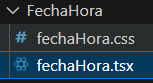
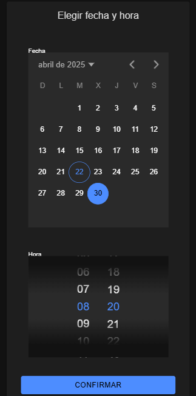

# FECHA Y HORA. 
## Componente de fecha y hora creado.



## Vista del calendario y la hora en la página de gestión de reservas.


## Código del componente Fecha y Hora

```tsx
<IonCard>
      <IonCardHeader>
        <IonCardTitle style={{ fontSize: '1.2rem', textAlign: 'center' }}>
          Elegir fecha y hora
        </IonCardTitle>
      </IonCardHeader>
      <IonCardContent>
        <IonGrid>
          <IonRow>
            <IonCol size="12" className="ion-padding-vertical">
              <IonItem lines="none">
                <IonLabel position="stacked">Fecha</IonLabel>
                <IonDatetime
                  presentation="date"
                  value={fecha}
                  onIonChange={(e) => {
                    const value = e.detail.value;
                    if (typeof value === 'string') {
                      setFecha(value);
                    }
                  }}
                  style={{ width: '100%' }}
                />
              </IonItem>
            </IonCol>

            <IonCol size="12" className="ion-padding-vertical">
              <IonItem lines="none">
                <IonLabel position="stacked">Hora</IonLabel>
                <IonDatetime
                  presentation="time"
                  value={hora}
                  onIonChange={(e) => {
                    const value = e.detail.value;
                    if (typeof value === 'string') {
                      setHora(value);
                    }
                  }}
                  style={{ width: '100%' }}
                />
              </IonItem>
            </IonCol>
          </IonRow>

          <IonRow>
            <IonCol size="12" className="ion-text-center ion-padding-top">
              <IonButton expand="block" onClick={confirmar}>
                Confirmar
              </IonButton>
            </IonCol>
          </IonRow>
        </IonGrid>
      </IonCardContent>
    </IonCard>
  );
};

```
