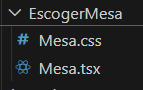
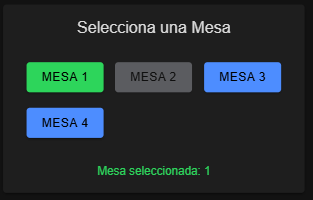

# Selección de Mesa. 
## Componente de la "selección de mesa".


## Vista de la "seleccion de mesa".

<p>La vista presenta las mesas que se encuentran disponibles como botones habilitados; las mesas que no se encuentran disponibles están inhabilitadas para seleccionar por el usuario.</p>

## Código del componente.

```tsx
   <IonCard>
      <IonCardHeader>
        <IonCardTitle style={{ fontSize: '1.2rem', textAlign: 'center' }}>
          Selecciona una Mesa
        </IonCardTitle>
      </IonCardHeader>
      <IonCardContent>
        <IonGrid>
          <IonRow>
            {mesas.map((mesa) => (
              <IonCol
                size="4"
                key={mesa.id}
                className="ion-text-center"
              >
                <IonButton
                  expand="block"
                  color={
                    !mesa.disponible
                      ? 'medium'
                      : mesaSeleccionada === mesa.id
                      ? 'success'
                      : 'primary'
                  }
                  disabled={!mesa.disponible}
                  onClick={() => seleccionarMesa(mesa.id)}
                >
                  Mesa {mesa.numero}
                </IonButton>
              </IonCol>
            ))}
          </IonRow>
        </IonGrid>
        {mesaSeleccionada && (
          <IonText color="success">
            <p className="ion-padding-top ion-text-center">
              Mesa seleccionada: {mesas.find((m) => m.id === mesaSeleccionada)?.numero}
            </p>
          </IonText>
        )}
      </IonCardContent>
    </IonCard>
```
