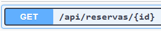
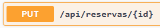
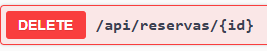
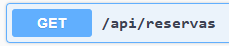
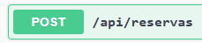

# Documentación Swagger. 
<p>
 A través de una interfaz web intuitiva, Swagger UI permite a los desarrolladores explorar todos los endpoints disponibles de una API, ver sus parámetros, tipos de datos, respuestas posibles y realizar pruebas directamente desde el navegador.

En proyectos basados en Spring Boot, Swagger se implementa comúnmente con la librería Springdoc OpenAPI, que genera automáticamente la documentación a partir del código fuente de la aplicación. Esta documentación cumple con el estándar OpenAPI, lo cual facilita la integración con otros servicios, el desarrollo frontend y la validación del comportamiento de la API.
</p>

# Endpoints.
## Obtener una reserva por id.



<p>
Debe retornar la reserva indicada por el id. Seleccioné el id 7 GET(/api/reservas/{id}).
</p>

```json
{
  "id": 7,
  "nombreCliente": "Paula",
  "fecha": "2025/02/02",
  "hora": "9:00",
  "mesaId": "3",
  "version": 1
}
```

## Actuliza reserva.


<p>
Actualiza una reserva por id. Actualicé la reserva con id 6.
</p>


```json
{
  "id": 6,
  "nombreCliente": "Camilo",
  "fecha": "2025/02/02",
  "hora": "9:00",
  "mesaId": "1",
  "version": 1
}
```

## Eliminar por id.


<p>
Debe eliminar la reserva especificando el id DELETE(/api/reservas/{id}).
</p>

## Obtener todas las reservas.

<p>
Debe devolver todas las reservas que existen en la base de datos.
</p>

```json
[
  {
    "id": 1,
    "nombreCliente": "Carlos",
    "fecha": "978",
    "hora": "979",
    "mesaId": "97897",
    "version": 0
  },
  {
    "id": 4,
    "nombreCliente": "Juan",
    "fecha": "2025/02/02",
    "hora": "9:00",
    "mesaId": "1",
    "version": 0
  },
  {
    "id": 5,
    "nombreCliente": "Juan",
    "fecha": "2025/02/02",
    "hora": "9:00",
    "mesaId": "1",
    "version": 0
  },
  {
    "id": 6,
    "nombreCliente": "Camilo",
    "fecha": "2025/02/02",
    "hora": "9:00",
    "mesaId": "1",
    "version": 1
  },
  {
    "id": 7,
    "nombreCliente": "Paula",
    "fecha": "2025/02/02",
    "hora": "9:00",
    "mesaId": "3",
    "version": 1
  }
]

```

## Agrega una nueva reserva.

<p>
Debe agregar una reserva a la base de datos con sus respectivos campos.
</p>

```json
{
  "id": 5,
  "nombreCliente": "Juan",
  "fecha": "2025/02/02",
  "hora": "9:00",
  "mesaId": "1",
  "version": 0
}

{
  "id": 6,
  "nombreCliente": "Maria",
  "fecha": "2025/02/02",
  "hora": "9:00",
  "mesaId": "1",
  "version": 0
}
```


