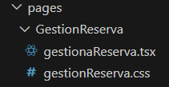
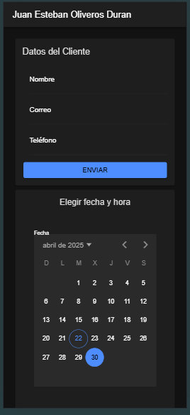
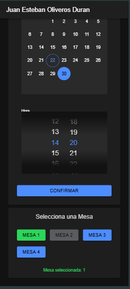

# Pantalla principal




## Vista de la pagína Gestión de Reservas.



## Código de la pagína "Gestión de Reserva".

```tsx
import React from 'react';
import {
  IonContent,
  IonHeader,
  IonPage,
  IonTitle,
  IonToolbar
} from '@ionic/react';
import { useHistory } from 'react-router-dom';
import Cliente from '../../components/DatosClientes/Cliente';
import './gestionReserva.css';
import CalendarioCompacto from '../../components/FechaHora/fechaHora';
import MesaSelector from '../../components/EscogerMesa/Mesa';

const Reserva: React.FC = () => {
  const history = useHistory();

  const mesasDisponibles = [
    { id: 'm1', numero: 1, disponible: true },
    { id: 'm2', numero: 2, disponible: false },
    { id: 'm3', numero: 3, disponible: true },
    { id: 'm4', numero: 4, disponible: true }
  ];

  const handleClienteSubmit = (data: { nombre: string; correo: string; telefono: string }) => {
    console.log('Cliente:', data);
  };


  return (
    <IonPage>
      <IonHeader>
        <IonToolbar>
          <IonTitle>Juan Esteban Oliveros Duran</IonTitle>
        </IonToolbar>
      </IonHeader>
      <IonContent className="ion-padding">
        <Cliente onSubmit={handleClienteSubmit} />
        <CalendarioCompacto onSeleccion={(datos) => {
        console.log('Fecha:', datos.fecha);
        console.log('Hora:', datos.hora);
         }} />
         <MesaSelector
            mesas={mesasDisponibles}
            onSeleccion={(mesaId) => {
            console.log('Mesa elegida:', mesaId);
            }}
            />
      </IonContent>
    </IonPage>
  );
};

export default Reserva;


```
